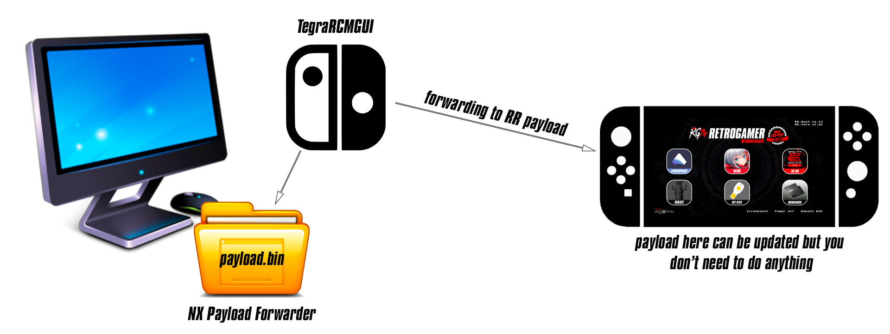

## What payload forwarder is?

It is a payload.bin to be used with TegraRCMGUI, as launcher, that will jump to boot the payload.bin already existing in your microsd:/payload.bin

That's all.

## Download

You can download it from [releases link.](https://github.com/RetroGamer74/NX_Payload_Forwarder/releases)

